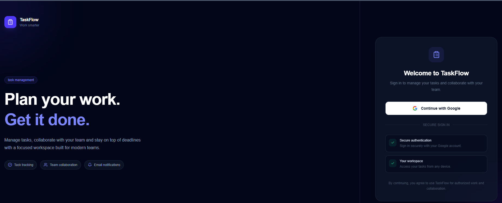

Task Management App

A simple and responsive Task Management Application developed as part of the Hair Drama assignment. The application allows users to create, manage, update, and organize tasks through an easy-to-use interface.

📌 Features
Create new tasks
View all tasks
Update task details
Mark tasks as completed
Delete tasks
Task status management
Responsive and user-friendly interface
Clean and simple UI
Deployed on Vercel
🛠️ Tech Stack
Frontend: React.js / Next.js
Language: JavaScript
Styling: CSS / Tailwind CSS
Deployment: Vercel
Version Control: Git & GitHub

Update the technologies above according to the exact technologies used in your project.

📂 Project Structure
task-management-app/
│
├── public/
│
├── src/
│   ├── components/
│   ├── pages/
│   ├── styles/
│   └── ...
│
├── package.json
├── README.md
└── ...
⚙️ Getting Started

Follow these steps to run the project locally.

1. Clone the repository
git clone YOUR_GITHUB_REPOSITORY_URL
2. Navigate to the project directory
cd task-management-app
3. Install dependencies
npm install
4. Start the development server
npm run dev

The application will be available at:

http://localhost:3000
🎯 Application Workflow
User opens the Task Management Application.
Existing tasks are displayed on the dashboard.
User can create a new task by entering the required details.
Tasks can be updated whenever changes are required.
Completed tasks can be marked accordingly.
Tasks that are no longer required can be deleted.
📱 Responsive Design

The application is designed to work across different screen sizes, including:

Desktop
Laptop
Tablet
Mobile
☁️ Deployment

The application is deployed using Vercel.

Any changes pushed to the connected GitHub repository can be deployed through Vercel.

🧪 Testing

The application was tested for:

Task creation
Task updating
Task deletion
Task completion/status changes
UI responsiveness
Basic user interactions

👩‍💻 Author

Prajakta Kadam

GitHub: https://github.com/Prajakta192005
LinkedIn: https://linkedin.com/in/prajakta-kadam-69389b263
📄 Assignment

This project was developed as part of the Hair Drama technical assignment to demonstrate practical skills in application development, UI implementation, task management functionality, and deployment.